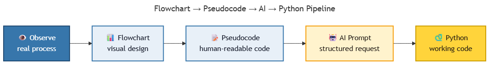
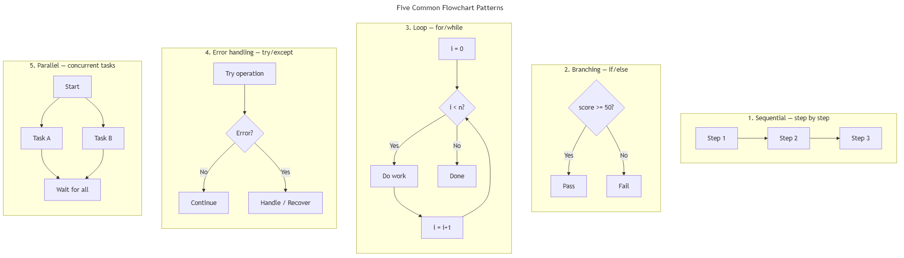
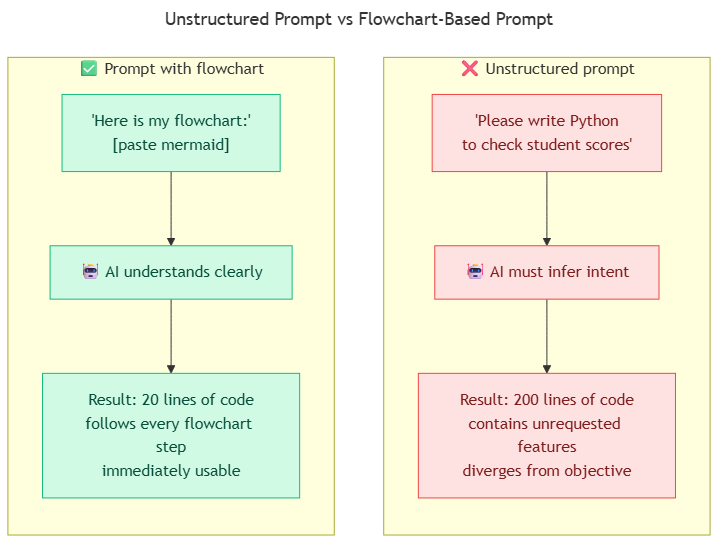

<!-- _class: ai-era -->

# AI Era Extension
## Topic 1 — Introduction & Flowchart

**Supplementary set of 9 slides** to accompany the original Topic 1 deck

Department of Mechanical & Mechatronics Engineering
Faculty of Engineering
Ubon Ratchathani University

> Instructors may omit this extension at their discretion; the core curriculum remains complete without it.

---

<!-- _class: ai-era -->

# The Renewed Significance of Flowcharts in the AI Era

**Before the AI era:**
- Programming typically began directly from source code
- Flowcharts served as supporting documentation
- Many learners did not retain flowchart skills in professional practice

**In the current era (2025 onward):**
- AI systems can generate source code rapidly
- However, AI **interprets flowcharts more reliably than ambiguous prose**
- Engineers who design flowcharts effectively can communicate with AI with substantially greater precision

> Key principle: **A clearly structured input enables AI to interpret user intent more accurately.**

---

<!-- _class: ai-era -->

# From Real-World Problem to Working Code — The Development Pipeline



| Stage | Activity | Estimated Time | Performed by |
|---|---|---|---|
| 1 | Observe and analyse the real-world process | 1–3 hours | Student |
| 2 | Design the flowchart | 10–30 minutes | Student |
| 3 | Write the pseudocode | 5–10 minutes | Student |
| 4 | Compose the AI prompt | 30 seconds | Student + AI |
| 5 | Review, test, and refine the code | 15–60 minutes | Student + AI |

> Stages 1–3 are the student's responsibility; stages 4–5 are conducted collaboratively with AI.

---

<!-- _class: ai-era -->

# Mermaid — Designing Flowcharts in Text Form

Advantages of text-based flowcharts compared with hand-drawn or graphical alternatives:

| Property | Hand-drawn / Graphical | Mermaid (text) |
|---|---|---|
| Submission to AI | Requires image conversion | Submitted directly |
| Modification | Redraw the entire figure | Edit a single line |
| Version control (Git) | Not supported | Fully supported |
| Sharing via digital channels | Cumbersome | Copy-paste immediately |

**Example Mermaid syntax:**
```
flowchart TD
    A[Start] --> B{score >= 50?}
    B -->|Yes| C[Pass]
    B -->|No| D[Fail]
```

> Students may experiment with the syntax at <https://mermaid.live>.

---

<!-- _class: ai-era -->

# Five Common Flowchart Patterns in Programming



| No. | Pattern | Application | Introduced in Topic |
|---|---|---|---|
| 1 | Sequential | Step-by-step processes | Topic 1–2 |
| 2 | Branching | Conditional logic (if/else) | Topic 5 |
| 3 | Loop | Repetition (for/while) | Topic 6 |
| 4 | Error handling | Exception catching (try/except) | Advanced |
| 5 | Parallel | Concurrent operations | Advanced |

> Students should master patterns 1–3 before progressing to patterns 4–5 in advanced topics.

---

<!-- _class: ai-era -->

# Comparison: Unstructured Prompts versus Flowchart-Based Prompts



- **Unstructured prompts:** AI must infer the user's intent, often producing results that diverge from the objective.
- **Flowchart-based prompts:** AI receives explicit structure, producing results aligned with the design.

> Principle: **A well-structured prompt yields more accurate results than a descriptive narrative.**

---

<!-- _class: ai-era -->

# Prompt Template — Translating a Flowchart into Code

A reusable template for use with AI assistants (Claude / ChatGPT / Cursor):

```
The flowchart for [process name] is as follows:

[insert Mermaid code or stepwise description]

Please perform the following:
1. Verify that the flowchart covers all edge cases, including
   invalid input types, empty inputs, and out-of-range values.
2. Translate the flowchart into Python 3.11 with type hints.
3. Add docstrings explaining each function's purpose.
4. Propose at least three test cases.
```

> This structured approach yields results more closely aligned with the intended specification than free-form descriptive prompts.

---

<!-- _class: ai-era -->

# Reviewing AI-Generated Flowcharts

AI-generated flowcharts may contain omissions. Users should verify the following five criteria for every flowchart received from an AI system:

1. **Start and End nodes** — Are both clearly defined?
2. **Arrows** — Does every arrow have a defined destination (no dangling arrows)?
3. **Decision nodes** — Do all decisions provide both Yes and No paths?
4. **Loops** — Is the exit condition explicit (avoiding infinite loops)?
5. **Error handling** — Are failure cases considered, not only the happy path?

> Criterion 5 is the most frequently overlooked. Users should explicitly request error-case coverage when prompting AI.

---

<!-- _class: ai-era -->

# In-Class Activity — Flowchart-First Prompting (15 minutes)

**Objective:** Practise using a flowchart as the starting point for AI-assisted programming.

| Time | Activity |
|---|---|
| 2 min | Identify a repetitive task within the university context (e.g., attendance taking, form submission, equipment borrowing) |
| 5 min | Design a flowchart of 5–10 nodes, on paper or in Mermaid |
| 3 min | Compose a prompt using the template from the previous slide and submit it to an AI assistant |
| 3 min | Test the resulting Python code with varied input data |
| 2 min | If errors are found, revise the **flowchart** before re-prompting the AI — not the code |

> Guiding principle: **Refine the flowchart first; then submit a revised prompt to the AI.**

---

<!-- _class: ai-era -->

# Summary — The Flowchart as a Communication Medium with AI

| Aspect | Before AI | In the Current Era |
|---|---|---|
| Role of the flowchart | Supporting documentation | **Primary input to AI** |
| Workflow sequence | Write code first, document later | Design flowchart first, then prompt AI |
| Retention of skill | Frequently forgotten after the course | A skill used throughout one's career |
| Professional value | Marginal | **A defining competency of the modern engineer** |

**Key takeaways for students:**
- Adopt flowchart-first thinking before writing code
- Acquire basic Mermaid syntax
- Use a structured prompt template when working with AI
- Apply the five-point checklist when reviewing AI outputs

> Next topic: Introduction to Python — translating flowcharts into executable code.
