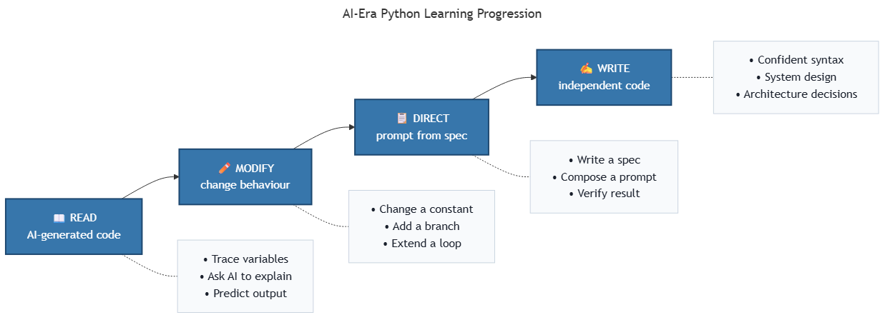

<!-- _class: ai-era -->

# AI Era Extension
## Topic 2 — Introduction to Python

**Supplementary set of 9 slides** to accompany the original Topic 2 deck

Department of Mechanical & Mechatronics Engineering
Faculty of Engineering
Ubon Ratchathani University

> Instructors may omit this extension at their discretion; the core curriculum remains complete without it.

---

<!-- _class: ai-era -->

# Why Python Remains Essential in the AI Era

**Before the AI era:**
- Python was one option among many programming languages
- Learners memorised syntax before attempting practical projects

**In the current era:**
- Python is the **dominant language of AI and data science** — most AI libraries (NumPy, pandas, scikit-learn, PyTorch, TensorFlow) are written in Python first
- AI assistants are most proficient in Python, having been trained on its enormous open-source corpus
- A learner who can **read and verify Python** can supervise AI output across virtually any domain

> Key principle: **Python literacy is now a prerequisite for working effectively with AI, even when one does not write code unaided.**

---

<!-- _class: ai-era -->

# The Reading-First Learning Paradigm

The traditional sequence (write → read → modify) is reversed:

| Stage | Activity | Time investment |
|---|---|---|
| 1 | **Read** code generated by AI, line by line | High (initial weeks) |
| 2 | **Modify** AI-generated code to alter behaviour | Medium |
| 3 | **Direct** AI from specifications | Medium |
| 4 | **Write** independently when required | Lower than traditional |

> A learner who can read fluently can verify, modify, and direct — without first mastering syntax through writing.

---

<!-- _class: ai-era -->

# Python Ecosystem — What Students Should Recognise

| Layer | Tools | Purpose |
|---|---|---|
| Language core | CPython 3.11+ | The interpreter itself |
| Package management | pip, venv | Installation and isolation of libraries |
| Editing | VS Code, Cursor | Code authoring with AI assistance |
| Interactive | Jupyter, Google Colab | Notebooks for data exploration |
| Web frameworks | Flask, Streamlit, FastAPI | Building deployable applications |
| Data libraries | NumPy, pandas, matplotlib | Numerical and analytical work |
| AI integration | requests, openai, anthropic | Connecting Python to LLM APIs |

> Students need not master every layer immediately; recognition of the ecosystem suffices in the early stages.

---

<!-- _class: ai-era -->

# Using AI as a Python Tutor — Five Essential Prompts

When encountering unfamiliar Python code, the following prompts yield reliable explanations:

1. **Line-by-line explanation:**
   > "Explain this code line by line for a first-year engineering student. Use everyday analogies."

2. **Variable trace table:**
   > "Produce a table showing how each variable changes through the loop. One row per iteration."

3. **Flowchart conversion:**
   > "Convert this code into a Mermaid flowchart. Include Yes/No labels on every decision."

4. **Comprehension check:**
   > "Ask me five questions of increasing difficulty to verify my understanding. Do not provide answers."

5. **Edge-case identification:**
   > "Identify three inputs that would cause this code to fail. Explain why."

> These prompts transform AI from a code generator into a learning partner.

---

<!-- _class: ai-era -->

# Common AI Mistakes in Python Output

Even competent AI assistants produce flawed Python code. The following errors occur frequently:

| Category | Example | How to detect |
|---|---|---|
| Over-engineering | Using classes where functions suffice | Question every `class` definition |
| Outdated patterns | `for i in range(len(x))` instead of `enumerate(x)` | Compare to current Python idioms |
| Silent failure | Bare `except:` swallowing all errors | Search for `except` without specific exception |
| Phantom imports | `from utils import helper` (file does not exist) | Run the code |
| Inconsistent types | Mixing `str` and `int` without conversion | Add type hints; run a type checker |
| Hard-coded values | API keys, file paths embedded directly | Review for any literal strings that should be variables |

> Verification through execution remains essential. Code that appears correct may fail on the first run.

---

<!-- _class: ai-era -->

# Reviewing AI-Generated Python — A Five-Point Checklist

Before accepting AI-generated code, verify the following:

1. **Execution** — Does the code run without errors on the intended Python version?
2. **Correctness** — Does it produce the expected output for known inputs?
3. **Edge cases** — Does it handle empty input, invalid types, and boundary values?
4. **Necessity** — Are all imports, classes, and functions actually used?
5. **Readability** — Could a peer understand the code without additional explanation?

> A failure in any single item indicates the code requires revision before adoption.

---

<!-- _class: ai-era -->

# In-Class Activity — Read, Modify, Verify (15 minutes)

**Objective:** Develop the discipline of reading AI-generated code before trusting it.

| Time | Activity |
|---|---|
| 2 min | Request AI to generate a short Python program (e.g., grade calculator, BMI calculator) |
| 4 min | Read the code without executing it. Predict the output for one sample input |
| 2 min | Execute the code and compare against the prediction |
| 4 min | Modify one element (a constant, a condition, a loop bound) and predict the new output |
| 3 min | Apply the five-point checklist to the final version |

> The objective is not to produce code, but to verify it. Verification is the AI-era core skill.

---

<!-- _class: ai-era -->

# Summary — Python in the AI Era

| Aspect | Before AI | In the Current Era |
|---|---|---|
| Learning sequence | Memorise syntax, then write programs | Read existing code, then modify and direct |
| Primary skill | Writing code from scratch | Verifying and refining AI output |
| Time on syntax drills | Substantial | Minimised — replaced by AI-assisted practice |
| Time on system thinking | Limited | **Expanded — the principal differentiator** |

**Key takeaways for students:**
- Adopt reading-first learning
- Use AI as a tutor, not merely as a code generator
- Apply the five-point review checklist to every AI output
- Recognise the Python ecosystem layers

> Next topic: Output — generating results in formats suitable for both human readers and AI consumers.
