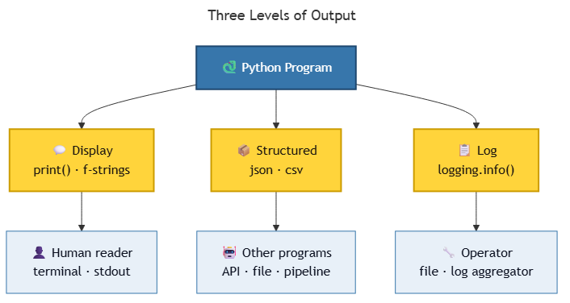

<!-- _class: ai-era -->

# AI Era Extension
## Topic 3 — Output

**Supplementary set of 8 slides** to accompany the original Topic 3 deck

Department of Mechanical & Mechatronics Engineering
Faculty of Engineering
Ubon Ratchathani University

> Instructors may omit this extension at their discretion; the core curriculum remains complete without it.

---

<!-- _class: ai-era -->

# Output in the AI Era — More Than `print()`

**Before the AI era:**
- `print()` was the principal mechanism for displaying results
- Output served chiefly the human reader

**In the current era:**
- Output is consumed by **humans, automated tools, and other AI systems**
- The form of output determines whether downstream automation succeeds
- A well-structured output enables AI to verify, transform, and act upon results

> Key principle: **Output is now an interface, not merely a display.**

---

<!-- _class: ai-era -->

# Three Levels of Output — Choose Deliberately



| Level | Mechanism | Audience | When to use |
|---|---|---|---|
| Display | `print()`, f-strings | Human reader | Interactive scripts, demonstrations |
| Structured | `json.dumps()`, `csv.writer()` | Automated tools, other programs | Data exchange, persistence |
| Log | `logging.info()`, `logging.error()` | Operators, debugging | Production systems, long-running processes |

> A single program often produces output at all three levels simultaneously.

---

<!-- _class: ai-era -->

# f-strings — The Modern Standard for Display

f-strings (formatted string literals, introduced in Python 3.6) are the recommended format:

```python
name = "Ploy"
score = 87.456

# Recommended:
print(f"Student {name} scored {score:.2f}")
# Output: Student Ploy scored 87.46

# Discouraged (legacy formats):
print("Student " + name + " scored " + str(round(score, 2)))      # verbose
print("Student %s scored %.2f" % (name, score))                   # outdated
print("Student {} scored {:.2f}".format(name, round(score, 2)))   # verbose
```

> AI assistants will frequently produce legacy formats. Request f-strings explicitly when reviewing output.

---

<!-- _class: ai-era -->

# Structured Output for AI Consumption

When output is intended for another program or AI system, prefer machine-readable formats:

```python
import json

result = {
    "student_id": "640001",
    "name": "Ploy",
    "scores": [85, 72, 91],
    "average": 82.67,
    "grade": "B"
}

print(json.dumps(result, ensure_ascii=False, indent=2))
```

Output:
```json
{
  "student_id": "640001",
  "name": "Ploy",
  "scores": [85, 72, 91],
  "average": 82.67,
  "grade": "B"
}
```

> Structured output enables an AI agent to parse, validate, and integrate results without ambiguity.

---

<!-- _class: ai-era -->

# Common AI Mistakes in Output Code

| Category | Example | Correct approach |
|---|---|---|
| String concatenation overuse | `"Score: " + str(s)` | Use f-strings: `f"Score: {s}"` |
| Missing format specifiers | Display of `3.141592653589793` | Apply `:.2f` for two decimals |
| Mixed encoding errors | Thai text rendered as `???` | Ensure UTF-8 and use `ensure_ascii=False` |
| Excessive `print()` for debugging | Dozens of `print(x)` statements | Use the `logging` module |
| Hardcoded labels in English | `"Grade: A"` (when audience reads Thai) | Localise display text appropriately |
| No final newline in files | Last record missing terminator | Use `print(..., file=f)` rather than `f.write` |

> Review every output statement for clarity, format, and locale appropriateness.

---

<!-- _class: ai-era -->

# Prompt Template — Requesting Well-Formatted Output

When asking AI to generate code that produces output:

```
Write a Python program that [task description].

Output requirements:
- Use f-strings for all formatting
- Format floating-point numbers with two decimal places
- Use UTF-8 encoding throughout
- Support both English and Thai text where applicable
- Separate human-readable output from any debug logging
- If output will be parsed by another program, produce valid JSON
```

> Explicit output specifications eliminate the most common categories of AI error.

---

<!-- _class: ai-era -->

# In-Class Activity — Output Quality Review (10 minutes)

**Objective:** Develop the habit of evaluating output quality across three dimensions.

| Time | Activity |
|---|---|
| 3 min | Request AI to generate a Python program that calculates and displays student grades from a list |
| 3 min | Run the program. Evaluate the output against three criteria: readability, precision, encoding |
| 2 min | Request a revision: convert the human-readable output into JSON format |
| 2 min | Verify that the JSON output parses correctly using `json.loads()` |

> Output is the only part of a program that users actually see — its quality directly determines perceived correctness.

---

<!-- _class: ai-era -->

# Summary — Output in the AI Era

| Aspect | Before AI | In the Current Era |
|---|---|---|
| Primary output mechanism | `print()` | f-strings + structured formats |
| Audience | Human reader | Humans + tools + AI agents |
| Debug logging | Mixed with output | Separated via `logging` module |
| Format specification | Implicit | Explicit (decimal places, encoding, structure) |

**Key takeaways for students:**
- Choose the output level deliberately: display, structured, or log
- Adopt f-strings as the default formatting mechanism
- Specify output requirements explicitly when prompting AI
- Verify encoding and localisation in every output statement

> Next topic: Input — capturing user input with validation suitable for both humans and automated systems.
