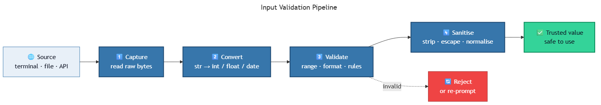

<!-- _class: ai-era -->

# AI Era Extension
## Topic 4 — Input

**Supplementary set of 8 slides** to accompany the original Topic 4 deck

Department of Mechanical & Mechatronics Engineering
Faculty of Engineering
Ubon Ratchathani University

> Instructors may omit this extension at their discretion; the core curriculum remains complete without it.

---

<!-- _class: ai-era -->

# Input in the AI Era — A Boundary, Not Merely a Statement

**Before the AI era:**
- `input()` was the standard mechanism for capturing user data
- Programs typically assumed cooperative users

**In the current era:**
- Input is the **trust boundary** between the program and the outside world
- Modern programs accept input from many sources: terminal, file, API, AI agent
- Robust input handling is the foundation of secure and reliable software

> Key principle: **Treat every input as untrusted until validated. AI-generated code routinely omits this discipline.**

---

<!-- _class: ai-era -->

# The Input Validation Pipeline



Every input passes through four stages:

| Stage | Concern | Example check |
|---|---|---|
| 1. Capture | Acquire raw input | `input()`, `sys.argv`, file read, API |
| 2. Type conversion | Convert string to required type | `int()`, `float()`, `datetime.strptime()` |
| 3. Validation | Verify constraints | Range check, format check, business rules |
| 4. Sanitisation | Remove or escape unsafe content | Strip whitespace, escape SQL, normalise unicode |

> Omitting any stage introduces a class of bugs that AI assistants frequently overlook.

---

<!-- _class: ai-era -->

# Modern Input Sources Beyond `input()`

A first-year programmer should recognise multiple input mechanisms:

| Source | Mechanism | Typical use |
|---|---|---|
| Terminal interactive | `input("prompt: ")` | Quick scripts, learning |
| Command-line arguments | `sys.argv`, `argparse` | CLI tools, automation |
| Files | `open()`, `pandas.read_csv()` | Batch processing, data pipelines |
| Environment variables | `os.getenv()` | Configuration, secrets |
| Web request body | Flask `request.json`, FastAPI | Web APIs, services |
| AI agent input | Function calls, structured prompts | LLM-integrated applications |

> The Topic 4 slides focus on `input()`; in practice, modern programs rarely use it outside teaching contexts.

---

<!-- _class: ai-era -->

# Validation Pattern — Type, Range, Format

A complete validation routine combines three checks:

```python
def read_score(prompt: str) -> int:
    """Read a score in the range 0–100. Repeat until valid input is given."""
    while True:
        raw = input(prompt).strip()
        # Type check
        if not raw.isdigit():
            print("Please enter a whole number.")
            continue
        score = int(raw)
        # Range check
        if not 0 <= score <= 100:
            print("Score must be between 0 and 100.")
            continue
        return score


score = read_score("Score: ")
```

> AI assistants often produce code without the `while True` retry loop, leaving the program to fail on the first invalid input.

---

<!-- _class: ai-era -->

# Common AI Mistakes in Input Code

| Category | Example | Correct approach |
|---|---|---|
| Missing type conversion | `score = input("...")` then arithmetic | Convert with `int()` or `float()` |
| No exception handling | `int("abc")` crashes the program | Wrap in `try`/`except ValueError` |
| Implicit trust of input | Pass raw input directly to a query | Validate and sanitise first |
| No retry loop | Program exits on first bad input | Loop until valid |
| Hardcoded prompts in one language | Thai-only or English-only prompts | Match the user's expected language |
| No empty-input handling | Pressing Enter with no value crashes | Explicitly handle the empty case |

> A program that crashes on bad input is incomplete, not robust.

---

<!-- _class: ai-era -->

# Prompt Template — Requesting Robust Input Handling

When asking AI to generate code that reads user input:

```
Write a Python function that reads [type of value] from the user.

Requirements:
- Validate that the input is the correct type
- Validate that the value is within range [specify]
- Re-prompt on invalid input until a valid value is given
- Handle empty input explicitly
- Strip leading and trailing whitespace
- Use type hints in the function signature
- Include a docstring describing the function
```

> Explicit validation requirements result in code that is robust on the first run.

---

<!-- _class: ai-era -->

# In-Class Activity — Adversarial Input Testing (12 minutes)

**Objective:** Verify that input-handling code survives unexpected user behaviour.

| Time | Activity |
|---|---|
| 3 min | Request AI to generate a Python program that reads a score and reports a grade |
| 4 min | Test the program with adversarial inputs: empty string, letters, negative numbers, very large numbers, whitespace |
| 3 min | Record which inputs cause failure |
| 2 min | Request a revision incorporating the validation pattern from this deck |

> The objective is not to break the program for amusement, but to discover the gaps that AI omitted.

---

<!-- _class: ai-era -->

# Summary — Input in the AI Era

| Aspect | Before AI | In the Current Era |
|---|---|---|
| Input source | Terminal `input()` | Terminal, file, API, environment, AI agent |
| Validation discipline | Often skipped in coursework | Required for any code intended for use |
| Trust model | Assumed cooperative user | Treat all input as untrusted |
| Error handling | Crash on bad input | Retry loop with clear messages |

**Key takeaways for students:**
- Treat every input as untrusted at the program boundary
- Apply the four-stage pipeline: capture, convert, validate, sanitise
- Request robust validation explicitly when prompting AI
- Test with adversarial inputs, not only with examples that succeed

> Next topic: Conditions — controlling program flow based on validated input.
