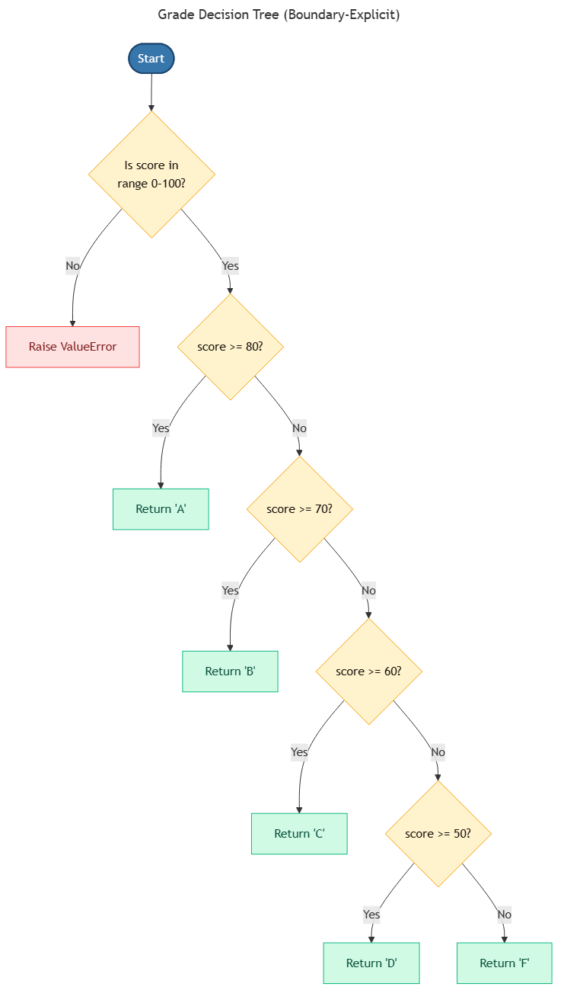

<!-- _class: ai-era -->

# AI Era Extension
## Topic 5 — Conditions

**Supplementary set of 8 slides** to accompany the original Topic 5 deck

Department of Mechanical & Mechatronics Engineering
Faculty of Engineering
Ubon Ratchathani University

> Instructors may omit this extension at their discretion; the core curriculum remains complete without it.

---

<!-- _class: ai-era -->

# Conditions — Where Specifications Meet Code

**Before the AI era:**
- Conditional logic was constructed line by line through experimentation
- Edge cases were discovered during testing, not at design time

**In the current era:**
- A clear specification of conditions enables AI to produce correct code on the first attempt
- AI is proficient at **translating** conditions but **may not infer** business rules that the programmer assumes
- The programmer's task shifts toward **enumerating all decision branches** before coding begins

> Key principle: **Conditions failed in specification cannot be repaired in code. List every branch explicitly.**

---

<!-- _class: ai-era -->

# The Decision Tree — Specifying Conditions Visually



A decision tree forces explicit consideration of every branch:

- Each diamond represents a condition
- Each branch leads to either a further condition or a terminal action
- No branch may be left undefined
- Every path from root to leaf must be traceable

> Drawing the decision tree before writing code typically reveals 1–2 forgotten branches.

---

<!-- _class: ai-era -->

# Boundary Specification — The `>=` versus `>` Trap

The most common AI error in conditional logic concerns boundary values:

```python
# Ambiguous specification: "score above 80 receives an A"
# Does 80 itself receive an A?

# Interpretation 1 (strict):
if score > 80:   grade = "A"   # 80 does NOT receive A

# Interpretation 2 (inclusive):
if score >= 80:  grade = "A"   # 80 receives A
```

**Recommended practice:** specify boundaries inclusively and unambiguously:

> "A score of 80 or greater receives an A; a score of 70 to 79 receives a B; ..."

> Always test the exact boundary values when verifying AI-generated conditional code.

---

<!-- _class: ai-era -->

# Common AI Mistakes in Conditional Logic

| Category | Example | Correct approach |
|---|---|---|
| Off-by-one boundary | `if score > 80` when 80 should qualify | Specify boundaries inclusively |
| Missing `else` branch | `if x > 0` with no handling for `x <= 0` | Cover every input class |
| Overlapping `elif` chains | Two branches that match the same input | Order from most specific to most general |
| Floating-point equality | `if total == 100.0` may fail due to rounding | Use `abs(total - 100.0) < epsilon` |
| Implicit truthiness | `if name:` may mismatch intent for empty strings | Use explicit `if name != ""` |
| Negation that confuses | `if not (a or not b)` | Apply De Morgan's law to simplify |

> Boundary errors are the single largest source of conditional bugs in AI-generated code.

---

<!-- _class: ai-era -->

# Pattern — The Guard Clause for Cleaner Logic

Nested conditionals reduce readability. Guard clauses provide a flatter alternative:

```python
# Nested (harder to read)
def calculate_grade(score):
    if 0 <= score <= 100:
        if score >= 80:
            return "A"
        elif score >= 70:
            return "B"
        else:
            return "F"
    else:
        return None

# With guard clauses (preferred)
def calculate_grade(score: int) -> str | None:
    if not 0 <= score <= 100:
        return None              # invalid input, exit early
    if score >= 80: return "A"
    if score >= 70: return "B"
    return "F"
```

> Guard clauses make the validation logic explicit and the main flow shallow.

---

<!-- _class: ai-era -->

# Prompt Template — Specifying Conditional Logic

When asking AI to implement conditional logic, supply a decision table:

```
Implement a Python function that determines the letter grade from a score.

Specification:
| Condition           | Result |
|---------------------|--------|
| score >= 80         | "A"    |
| 70 <= score < 80    | "B"    |
| 60 <= score < 70    | "C"    |
| 50 <= score < 60    | "D"    |
| 0 <= score < 50     | "F"    |
| Any other input     | raise ValueError |

Requirements:
- Use type hints
- Test boundary values: 0, 50, 60, 70, 80, 100
```

> A decision table eliminates ambiguity that descriptive prose leaves open.

---

<!-- _class: ai-era -->

# In-Class Activity — Boundary Verification (12 minutes)

**Objective:** Develop the discipline of testing exact boundary values.

| Time | Activity |
|---|---|
| 3 min | Request AI to generate a grade calculator from the decision table above |
| 4 min | Test with the exact boundary values: 0, 49, 50, 59, 60, 69, 70, 79, 80, 100 |
| 3 min | Record which boundaries are handled correctly and which fail |
| 2 min | Request a corrected version if any boundary fails; re-test |

> The boundaries are where bugs hide. Examples in the middle of each range rarely reveal problems.

---

<!-- _class: ai-era -->

# Summary — Conditions in the AI Era

| Aspect | Before AI | In the Current Era |
|---|---|---|
| Construction | Trial and error in code | Decision tree or table before code |
| Boundary handling | Discovered through testing | Specified explicitly at design time |
| Verification | Examples from the middle of each range | Exact boundary values |
| Refactoring | Manual restructuring | AI-assisted with guard clauses |

**Key takeaways for students:**
- Draw the decision tree or write the decision table before writing code
- Specify boundaries inclusively and unambiguously
- Test exact boundary values, not interior values
- Prefer guard clauses to deeply nested conditionals

> Next topic: Repetition — controlling iteration with the same rigour applied to conditions.
