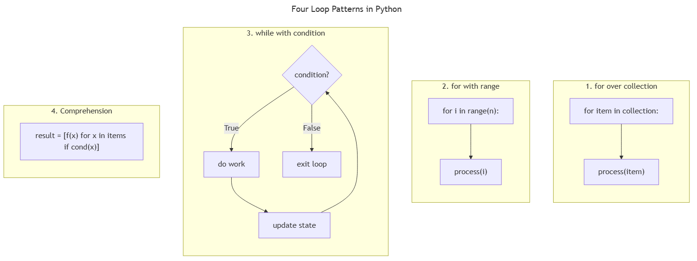

<!-- _class: ai-era -->

# AI Era Extension
## Topic 6 — Repetition

**Supplementary set of 8 slides** to accompany the original Topic 6 deck

Department of Mechanical & Mechatronics Engineering
Faculty of Engineering
Ubon Ratchathani University

> Instructors may omit this extension at their discretion; the core curriculum remains complete without it.

---

<!-- _class: ai-era -->

# Loops in the AI Era — Pattern Recognition over Mechanics

**Before the AI era:**
- Learners drilled `for` and `while` syntax extensively
- Loop bodies were constructed by hand for each problem

**In the current era:**
- AI is highly proficient at producing loop syntax
- The learner's responsibility becomes **selecting the correct pattern** for the task
- Many tasks that previously required explicit loops are now expressed through comprehensions, generators, or vectorised operations

> Key principle: **Choose the loop pattern that expresses intent most clearly. Syntax is the AI's job; choice is yours.**

---

<!-- _class: ai-era -->

# Four Loop Patterns — When to Use Each



| Pattern | Use case | Example |
|---|---|---|
| `for` over collection | Process every item once | `for student in students:` |
| `for` with `range` | A fixed number of iterations | `for i in range(10):` |
| `while` with condition | Repeat until a state is reached | `while not done:` |
| Comprehension | Transform or filter a collection | `[s.upper() for s in names]` |

> The pattern should be chosen for clarity of intent, not for brevity alone.

---

<!-- _class: ai-era -->

# Comprehensions — The Pythonic Alternative to Many Loops

Comprehensions express transformation and filtering concisely:

```python
scores = [85, 72, 45, 91, 60]

# Traditional loop:
passed = []
for s in scores:
    if s >= 50:
        passed.append(s)

# Comprehension (preferred when applicable):
passed = [s for s in scores if s >= 50]

# Dictionary comprehension:
grades = {name: calc_grade(s) for name, s in zip(names, scores)}

# Set comprehension (for unique results):
unique_grades = {calc_grade(s) for s in scores}
```

> AI assistants often default to traditional loops. Request comprehensions explicitly when they improve clarity.

---

<!-- _class: ai-era -->

# Common AI Mistakes in Loop Code

| Category | Example | Correct approach |
|---|---|---|
| Off-by-one in `range` | `range(1, n)` when 0-indexed needed | Verify endpoint behaviour |
| Modification during iteration | `for x in lst: lst.remove(x)` | Iterate over a copy or use comprehension |
| Infinite `while` loops | Condition never becomes false | Ensure the controlling variable changes |
| Using index when not needed | `for i in range(len(x)): print(x[i])` | Use `for item in x:` directly |
| Premature optimisation | Manual loop replacing built-in `sum()` | Use built-in functions first |
| Nested loops where vectorised | Three-level nesting for array operations | Consider NumPy or comprehensions |

> Loops are easy to write but subtly easy to write incorrectly. Trace the first and last iteration manually.

---

<!-- _class: ai-era -->

# Pattern — `enumerate` and `zip` for Cleaner Iteration

Two built-in functions eliminate common loop pitfalls:

```python
names = ["Ploy", "Nat", "Mint"]
scores = [85, 72, 91]

# Indexing — when the index itself is needed
for index, name in enumerate(names):
    print(f"{index}: {name}")

# Parallel iteration — when traversing two collections in lock-step
for name, score in zip(names, scores):
    print(f"{name}: {score}")

# Both combined — index and parallel
for i, (name, score) in enumerate(zip(names, scores)):
    print(f"Student {i}: {name} scored {score}")
```

> Code using `range(len(x))` typically indicates that `enumerate` was forgotten.

---

<!-- _class: ai-era -->

# Prompt Template — Requesting Idiomatic Loop Code

When asking AI to generate iteration code:

```
Write a Python function that [task involving iteration].

Requirements:
- Use idiomatic Python (comprehensions where appropriate)
- Prefer enumerate() and zip() over range(len(...))
- Use built-in functions (sum, max, min, any, all) where applicable
- Avoid modifying a collection while iterating over it
- Add a clear exit condition for any while loop
- Include type hints in the function signature
```

> Specifying idiomatic patterns explicitly directs AI away from legacy loop styles.

---

<!-- _class: ai-era -->

# In-Class Activity — Refactoring AI Loops (12 minutes)

**Objective:** Recognise opportunities to improve AI-generated loop code.

| Time | Activity |
|---|---|
| 3 min | Request AI to generate a program that filters a list of scores into pass and fail groups |
| 3 min | Identify the pattern used: explicit `for` loop, comprehension, or built-in function |
| 3 min | Rewrite the code using a list comprehension if a `for` loop was generated |
| 3 min | Compare line counts and clarity between the two versions |

> A shorter version is not always better — but a comprehension that fits in one line often communicates intent more clearly than a three-line loop.

---

<!-- _class: ai-era -->

# Summary — Repetition in the AI Era

| Aspect | Before AI | In the Current Era |
|---|---|---|
| Skill emphasis | Loop syntax mastery | Pattern selection |
| Default construction | Explicit `for` loops | Comprehensions where they improve clarity |
| Iteration over index | `range(len(x))` | `enumerate()` and `zip()` |
| Common operations | Manual accumulation | Built-in `sum`, `max`, `any`, `all` |

**Key takeaways for students:**
- Recognise four loop patterns and the situations where each applies
- Prefer comprehensions and built-in functions for common transformations
- Use `enumerate` and `zip` rather than indexed `range(len(x))`
- Trace the first and last iteration manually when reviewing AI output

> Next topic: Functions — packaging loop and conditional logic for reuse and clarity.
