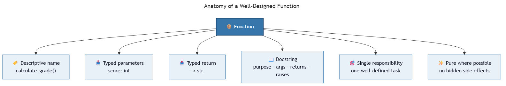

<!-- _class: ai-era -->

# AI Era Extension
## Topic 7 — User-Defined Functions

**Supplementary set of 9 slides** to accompany the original Topic 7 deck

Department of Mechanical & Mechatronics Engineering
Faculty of Engineering
Ubon Ratchathani University

> Instructors may omit this extension at their discretion; the core curriculum remains complete without it.

---

<!-- _class: ai-era -->

# Functions — The Unit of Communication Between Human and AI

**Before the AI era:**
- Functions were units of code reuse within a single programmer's work
- Naming and documentation were often informal

**In the current era:**
- Functions are the **unit of specification** when working with AI
- A function with a clear signature, docstring, and type hints is unambiguous to both humans and AI
- Function design directly determines the quality of AI-generated implementation

> Key principle: **A well-designed function signature is half of the specification. AI fills in the body reliably given a clear interface.**

---

<!-- _class: ai-era -->

# Anatomy of a Well-Designed Function



A function suitable for AI collaboration includes:

| Element | Purpose |
|---|---|
| Descriptive name | Communicates intent (`calculate_grade`, not `do_it`) |
| Type hints on parameters | Specifies expected input types |
| Type hint on return | Specifies output type |
| Docstring | Explains purpose, parameters, return value, and exceptions |
| Single responsibility | Performs one well-defined task |
| Pure where possible | No hidden side effects |

> Each element narrows the space of valid implementations, leaving AI less room for misinterpretation.

---

<!-- _class: ai-era -->

# Type Hints — A Specification Tool

Type hints serve as machine-readable documentation:

```python
from typing import Optional

def calculate_grade(score: int) -> str:
    """Return the letter grade for a score between 0 and 100.

    Args:
        score: An integer in the range 0–100.

    Returns:
        A single-character grade: 'A', 'B', 'C', 'D', or 'F'.

    Raises:
        ValueError: If score is outside the valid range.
    """
    if not 0 <= score <= 100:
        raise ValueError(f"Score {score} is outside the valid range 0–100.")
    if score >= 80: return "A"
    if score >= 70: return "B"
    if score >= 60: return "C"
    if score >= 50: return "D"
    return "F"
```

> Type hints are optional in Python execution but essential for AI collaboration and modern code review tools.

---

<!-- _class: ai-era -->

# Common AI Mistakes in Function Code

| Category | Example | Correct approach |
|---|---|---|
| Over-decomposition | Splitting a 10-line task into six tiny functions | Functions should encapsulate one concept, not one statement |
| Hidden side effects | Function modifies global state silently | Document side effects; prefer return values |
| Inconsistent return types | Returns `int` on success, `None` on failure | Use `Optional[int]` and document clearly |
| Mutable default arguments | `def f(items=[]):` | Use `def f(items: list = None): if items is None: items = []` |
| Excessive parameters | Functions with 8+ parameters | Group related parameters into a dataclass or dict |
| Misleading docstrings | Docstring describes old behaviour | Update docstring whenever signature changes |

> AI assistants often produce technically correct but stylistically poor functions. Apply the criteria above to every generated function.

---

<!-- _class: ai-era -->

# Pure Functions — The Preferred Default

A pure function depends only on its inputs and produces no side effects:

```python
# Pure (preferred)
def calculate_average(scores: list[int]) -> float:
    """Compute the arithmetic mean of a list of scores."""
    return sum(scores) / len(scores)

# Impure (avoid unless necessary)
total_count = 0
def increment_and_report(value: int) -> int:
    """Increment global counter and return new total."""
    global total_count
    total_count += value
    return total_count
```

**Advantages of pure functions:**
- Easier to test (no setup or teardown required)
- Easier to reason about (output depends only on input)
- Safer for AI to modify (no hidden dependencies)
- Simpler to compose with other functions

> Reserve impure functions for genuine boundaries: file I/O, network calls, database access.

---

<!-- _class: ai-era -->

# Prompt Template — Requesting Function Specifications

When asking AI to generate a function, supply the specification:

```
Implement a Python function with the following specification:

Function name: [name]
Purpose: [one-sentence description]
Parameters:
  - param1 (type): description
  - param2 (type): description
Returns: (type) description
Raises: [exception types and conditions]

Requirements:
- Use type hints
- Include a docstring in Google format
- Function must be pure (no side effects)
- Validate input at the start of the function
- Provide at least three test cases at the bottom
```

> A complete specification yields a complete implementation. Partial specifications yield partial code.

---

<!-- _class: ai-era -->

# In-Class Activity — Function Quality Review (15 minutes)

**Objective:** Apply the function-quality criteria to AI-generated code.

| Time | Activity |
|---|---|
| 3 min | Request AI to generate three small functions: BMI calculator, factorial, list reversal |
| 4 min | Evaluate each function against the six anatomy criteria from this deck |
| 4 min | Identify the weakest function and request a revision incorporating the missing elements |
| 4 min | Compare the original and revised versions; document which improvements mattered most |

> Function quality is not a matter of style — it determines how reliably AI can extend or modify the code later.

---

<!-- _class: ai-era -->

# Summary — Functions in the AI Era

| Aspect | Before AI | In the Current Era |
|---|---|---|
| Primary purpose | Code reuse for the programmer | Specification interface for AI |
| Type information | Optional, often absent | Essential — directs AI implementation |
| Docstrings | Brief or omitted | Complete with parameters, returns, exceptions |
| Side effects | Tolerated for convenience | Avoided by default; documented when necessary |

**Key takeaways for students:**
- Treat the function signature as the primary specification
- Apply type hints to every parameter and return value
- Prefer pure functions; document impurity where unavoidable
- Use the six-element anatomy as a review checklist

> Next topic: NumPy — applying disciplined function design to numerical and array operations.
