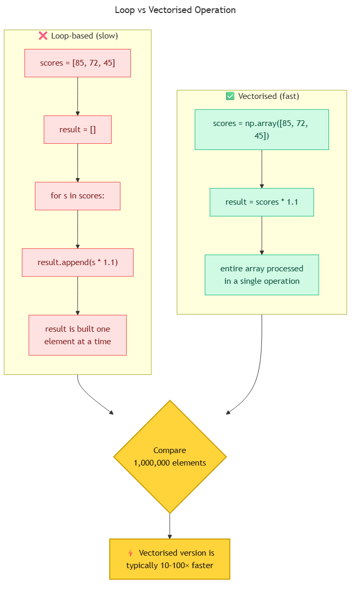

<!-- _class: ai-era -->

# AI Era Extension
## Topic 8 — NumPy

**Supplementary set of 8 slides** to accompany the original Topic 8 deck

Department of Mechanical & Mechatronics Engineering
Faculty of Engineering
Ubon Ratchathani University

> Instructors may omit this extension at their discretion; the core curriculum remains complete without it.

---

<!-- _class: ai-era -->

# NumPy in the AI Era — The Foundation Beneath Everything

**Before the AI era:**
- NumPy was treated as one library among many
- Many numerical tasks were performed with plain Python lists

**In the current era:**
- NumPy is the **substrate of virtually every AI and scientific library** in Python (pandas, scikit-learn, PyTorch, TensorFlow all build on NumPy)
- Fluency in `ndarray` operations is a prerequisite for working with modern data tools
- The vectorised mindset replaces explicit loops in most numerical work

> Key principle: **In numerical Python, the goal is to avoid explicit loops. Express the operation on the entire array at once.**

---

<!-- _class: ai-era -->

# Vectorisation — The Core Concept



A loop-based operation and its vectorised equivalent:

```python
import numpy as np

scores = np.array([85, 72, 45, 91, 60, 33, 78])

# Loop-based (slow, verbose):
result = []
for s in scores:
    result.append(s * 1.1)
result = np.array(result)

# Vectorised (fast, concise):
result = scores * 1.1
```

> The vectorised form is typically 10–100 times faster and significantly more readable.

---

<!-- _class: ai-era -->

# Broadcasting — Operations Across Different Shapes

NumPy automatically aligns arrays of compatible shapes:

```python
import numpy as np

scores = np.array([[85, 72, 91],   # student 1's three exams
                   [60, 88, 75],   # student 2's three exams
                   [45, 50, 38]])  # student 3's three exams

# Apply a bonus to every score
scores_with_bonus = scores + 5

# Apply different weights to each exam column
weights = np.array([0.3, 0.3, 0.4])
weighted = scores * weights        # broadcasts along rows
final_scores = weighted.sum(axis=1)
```

> Broadcasting eliminates many cases where a programmer might otherwise write nested loops.

---

<!-- _class: ai-era -->

# Common AI Mistakes in NumPy Code

| Category | Example | Correct approach |
|---|---|---|
| Loop instead of vectorisation | `for i in range(len(a)): b[i] = a[i] * 2` | `b = a * 2` |
| Python list instead of array | `mean = sum(lst) / len(lst)` | `mean = np.array(lst).mean()` |
| Wrong axis | `arr.sum()` when row-sum needed | Specify `axis=1` for row, `axis=0` for column |
| Integer overflow | `np.int8` arrays exceeding 127 | Use `np.int32` or `np.int64` by default |
| Reshape without verification | `arr.reshape(2, 3)` when shape mismatches | Use `-1` for inferred dimension: `arr.reshape(-1, 3)` |
| Copy vs view confusion | Modifying a slice unexpectedly changes the original | Use `.copy()` explicitly when independence is needed |

> AI assistants sometimes regress to Python-list style. Verify that all numerical operations exploit NumPy fully.

---

<!-- _class: ai-era -->

# The Axis Concept — A Persistent Source of Confusion

The `axis` parameter determines the direction of an operation:

```python
import numpy as np

grades = np.array([[85, 72, 91],
                   [60, 88, 75],
                   [45, 50, 38]])

grades.sum()           # 604 — sum of all elements
grades.sum(axis=0)     # [190, 210, 204] — sum down each column
grades.sum(axis=1)     # [248, 223, 133] — sum across each row
```

**Mnemonic:** `axis=0` collapses rows (produces one value per column); `axis=1` collapses columns (produces one value per row).

> When AI-generated code produces unexpected aggregate values, the `axis` argument is the first place to look.

---

<!-- _class: ai-era -->

# Prompt Template — Requesting Idiomatic NumPy Code

When asking AI to generate numerical code:

```
Write Python code using NumPy to [task description].

Requirements:
- Use vectorised operations; no explicit Python loops for numerical work
- Use broadcasting where applicable instead of repeating arrays
- Specify the axis argument explicitly for any aggregation
- Use np.array (not Python lists) for input
- Specify dtype explicitly (e.g., np.float64) where precision matters
- Avoid mixing NumPy arrays with Python lists in arithmetic
```

> Explicit requests for vectorisation prevent AI from producing slow, list-based code.

---

<!-- _class: ai-era -->

# In-Class Activity — Vectorisation Refactoring (12 minutes)

**Objective:** Convert loop-based numerical code into vectorised form.

| Time | Activity |
|---|---|
| 3 min | Request AI to generate a loop-based program that computes the mean and standard deviation of student scores |
| 3 min | Time the execution with `time.perf_counter()` over 1,000 students |
| 3 min | Request a vectorised rewrite using NumPy operations only |
| 3 min | Time the rewritten version and compare; document the speedup factor |

> The performance difference is typically large enough that students will recognise the value of vectorisation immediately.

---

<!-- _class: ai-era -->

# Summary — NumPy in the AI Era

| Aspect | Before AI | In the Current Era |
|---|---|---|
| Position in the ecosystem | One library among many | Foundation of nearly all AI tooling |
| Typical operation | Python loop with manual indexing | Vectorised array operation |
| Loop-vs-vector decision | Programmer chose by experience | Vectorise by default; loop only as exception |
| Axis specification | Often omitted | Always explicit for aggregations |

**Key takeaways for students:**
- Express operations on whole arrays rather than element-by-element
- Use broadcasting to combine arrays of different shapes cleanly
- Always specify the `axis` argument for aggregations
- Time loop-based vs vectorised code at least once to internalise the difference

> Next topic: OOP and Matplotlib — applying disciplined design to classes and visualisations.
