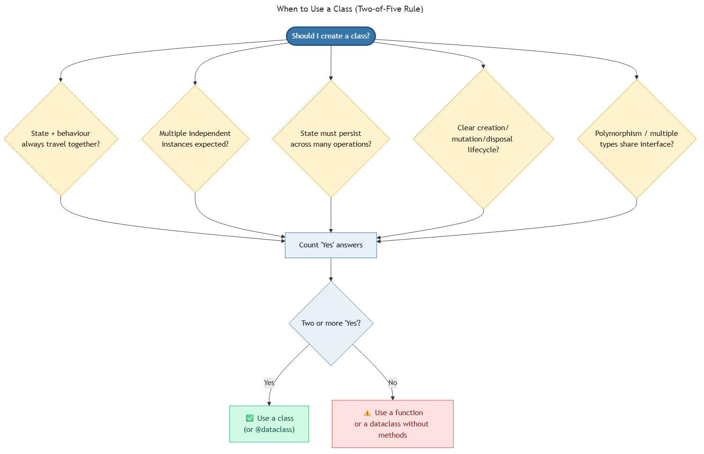

<!-- _class: ai-era -->

# AI Era Extension
## Topic 9 — OOP & Matplotlib

**Supplementary set of 9 slides** to accompany the original Topic 9 deck

Department of Mechanical & Mechatronics Engineering
Faculty of Engineering
Ubon Ratchathani University

> Instructors may omit this extension at their discretion; the core curriculum remains complete without it.

---

<!-- _class: ai-era -->

# OOP in the AI Era — When Not to Use It

**Before the AI era:**
- OOP was taught as a default mode of organising code
- Many programs created classes that contained little more than functions and global state

**In the current era:**
- AI assistants strongly favour OOP, often **over-applying it** to small problems
- The first-year programmer's most valuable OOP skill is recognising **when a class is unnecessary**
- For most introductory problems, plain functions with type hints suffice

> Key principle: **OOP is a tool with a specific purpose. Do not introduce a class without a concrete need for one.**

---

<!-- _class: ai-era -->

# When Is a Class Appropriate?



A class is justified when **at least two** of the following apply:

1. **State + behaviour bound together** — data and operations that always travel as a unit
2. **Multiple instances** — many independent objects with the same structure
3. **Long-lived state** — data persisting across many operations
4. **Clear lifecycle** — explicit creation, mutation, and disposal phases
5. **Polymorphism required** — multiple types share an interface

When none of these apply, a function or a dataclass is preferable.

> AI assistants frequently create classes that wrap a single function. This is rarely the correct design.

---

<!-- _class: ai-era -->

# A Genuine Use Case — The Student Class

```python
from dataclasses import dataclass, field

@dataclass
class Student:
    """A student with associated scores."""
    student_id: str
    name: str
    scores: list[int] = field(default_factory=list)

    def add_score(self, score: int) -> None:
        if not 0 <= score <= 100:
            raise ValueError(f"Score {score} is out of range.")
        self.scores.append(score)

    def average(self) -> float:
        return sum(self.scores) / len(self.scores) if self.scores else 0.0

    def grade(self) -> str:
        avg = self.average()
        if avg >= 80: return "A"
        if avg >= 70: return "B"
        return "F"
```

> The class is justified: state (`scores`) and behaviour (`add_score`, `average`, `grade`) are bound together, with many instances expected.

---

<!-- _class: ai-era -->

# Common AI Mistakes in OOP Code

| Category | Example | Correct approach |
|---|---|---|
| Class for single operation | `class GradeCalculator: def calculate(...)` | Use a plain function |
| Wrapper class around dict | A class with only `self.data = {...}` | Use a dict or dataclass |
| Inheritance overuse | Three-level class hierarchy for trivial differences | Use composition or duck typing |
| Mutable state without need | Class attributes modified across methods | Use return values where possible |
| Constructor with side effects | `__init__` opens files, calls APIs | Construct cheaply; perform work in named methods |
| `self.` everywhere unnecessarily | Methods that take no instance state | These should be functions, not methods |

> Apply the "two-of-five" rule: if fewer than two justification criteria apply, refactor to a function.

---

<!-- _class: ai-era -->

# Matplotlib — Quality Visualisations

A presentable chart requires more than `plt.plot()`. Apply the following structure:

```python
import matplotlib.pyplot as plt
import numpy as np

scores = np.array([85, 72, 45, 91, 60, 33, 78])

fig, ax = plt.subplots(figsize=(8, 5))
ax.bar(range(len(scores)), scores, color="#3776ab")
ax.axhline(y=50, color="red", linestyle="--", label="Passing threshold")
ax.set_xlabel("Student Index")
ax.set_ylabel("Score (out of 100)")
ax.set_title("Class Performance Distribution")
ax.set_ylim(0, 100)
ax.legend()
ax.grid(axis="y", alpha=0.3)
fig.tight_layout()
plt.savefig("scores.png", dpi=150)
plt.show()
```

> Every chart requires title, axis labels, units, and either a legend or annotation. AI-generated charts often omit one or more of these.

---

<!-- _class: ai-era -->

# Common AI Mistakes in Matplotlib Code

| Category | Example | Correct approach |
|---|---|---|
| `plt.plot()` without context | Chart with no title or labels | Add title, xlabel, ylabel, and units |
| Default colours obscuring meaning | Multiple lines all in matplotlib blue | Use distinct colours; consider colour-blind palettes |
| Missing legend | Multiple series without identification | Add `plt.legend()` with explicit labels |
| Wrong figure size | Chart cramped or distorted | Specify `figsize=(width, height)` |
| Saving without `tight_layout()` | Labels clipped in saved file | Call `fig.tight_layout()` before `savefig` |
| `plt.show()` in a script | Blocks execution unintentionally | Use `plt.savefig()` for scripts; `plt.show()` for interactive sessions |

> A chart is a communication device. Quality is judged by whether a viewer understands the message without explanation.

---

<!-- _class: ai-era -->

# In-Class Activity — OOP Necessity Test (15 minutes)

**Objective:** Distinguish problems that benefit from classes from those that do not.

| Time | Activity |
|---|---|
| 3 min | Request AI to generate three small programs: BMI calculator, student grade tracker, file converter |
| 4 min | Identify which programs were implemented with classes and which with functions only |
| 4 min | For each class generated, apply the two-of-five rule from this deck |
| 4 min | Request a refactoring where the rule is not satisfied; compare line counts |

> Recognising over-engineered code is a more advanced skill than writing OOP. Practising it early prevents bad habits.

---

<!-- _class: ai-era -->

# Summary — OOP and Matplotlib in the AI Era

| Aspect | Before AI | In the Current Era |
|---|---|---|
| Default code structure | Classes by habit | Functions by default; classes when justified |
| Class justification | Assumed required for "real" programs | Two of five criteria must apply |
| Visualisation quality | Charts often unlabelled | Title, axes, units, legend required |
| AI's bias | Not applicable | Strongly favours OOP — counterbalance explicitly |

**Key takeaways for students:**
- Apply the two-of-five rule before introducing any class
- Prefer dataclasses to manual `__init__` boilerplate where appropriate
- Every chart requires title, axis labels, units, and a legend or annotation
- Use `tight_layout()` and `savefig()` for script-based workflows

> Next topic: Pandas — applying the same disciplined approach to tabular data.
