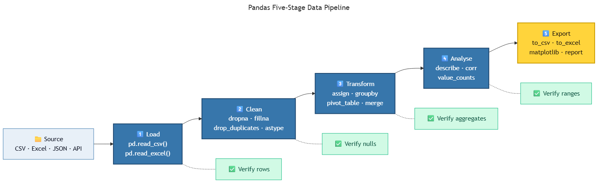

<!-- _class: ai-era -->

# AI Era Extension
## Topic 10 — Pandas

**Supplementary set of 9 slides** to accompany the original Topic 10 deck

Department of Mechanical & Mechatronics Engineering
Faculty of Engineering
Ubon Ratchathani University

> Instructors may omit this extension at their discretion; the core curriculum remains complete without it.

---

<!-- _class: ai-era -->

# Pandas in the AI Era — The Universal Data Table

**Before the AI era:**
- Pandas was one of several options for handling tabular data
- Many practitioners used spreadsheets or custom CSV-parsing code

**In the current era:**
- Pandas is the **default tool** for tabular data in Python, with universal support across AI and data libraries
- AI assistants are highly proficient at producing pandas code, often suggesting it even when simpler tools would suffice
- The `DataFrame` has become a lingua franca between data sources, analyses, and reporting tools

> Key principle: **Pandas is powerful but verbose. AI assistance dramatically lowers the cost of writing it; verification remains the human's responsibility.**

---

<!-- _class: ai-era -->

# The Pandas Data Pipeline



Most data analyses follow the same five-stage pipeline:

| Stage | Operation | Typical methods |
|---|---|---|
| 1. Load | Read data into memory | `pd.read_csv`, `pd.read_excel`, `pd.read_json` |
| 2. Clean | Handle missing, duplicate, malformed data | `dropna`, `fillna`, `drop_duplicates`, `astype` |
| 3. Transform | Compute new columns, reshape, aggregate | `assign`, `groupby`, `pivot_table`, `merge` |
| 4. Analyse | Compute statistics, identify patterns | `describe`, `corr`, `value_counts` |
| 5. Export | Save results for downstream consumers | `to_csv`, `to_excel`, `to_json`, plotting |

> Every analysis should be traceable through these five stages. Code that skips a stage usually contains a hidden assumption.

---

<!-- _class: ai-era -->

# Common AI Mistakes in Pandas Code

| Category | Example | Correct approach |
|---|---|---|
| `iterrows()` for transformation | Looping over rows to compute a column | Use vectorised operations: `df["new"] = df["a"] + df["b"]` |
| `SettingWithCopyWarning` ignored | Chained indexing modifying views | Use `.loc[]` for explicit indexing |
| Missing data silently dropped | `dropna()` without examination | Inspect missing-data patterns before dropping |
| `df.append()` in a loop | Building a DataFrame row by row | Build a list of dicts, then convert once |
| `for col in df.columns: df[col] = ...` | Column-wise loop | Use `df.apply()` or vectorised assignment |
| Hardcoded column names | Code breaks when columns are renamed | Use constants or validate columns at entry |

> Pandas code that runs may still be incorrect. Compare row counts and verify aggregates against an independent calculation.

---

<!-- _class: ai-era -->

# Method Chaining — The Modern Idiom

Method chaining produces readable, linear transformations:

```python
import pandas as pd

# Verbose, intermediate variables:
df = pd.read_csv("students.csv")
df = df.dropna()
df["pass"] = df["score"] >= 50
grouped = df.groupby("major")["score"].mean()
result = grouped.sort_values(ascending=False)

# Equivalent method-chained form:
result = (
    pd.read_csv("students.csv")
      .dropna()
      .assign(passed=lambda x: x["score"] >= 50)
      .groupby("major")["score"]
      .mean()
      .sort_values(ascending=False)
)
```

> Method chaining flows top-to-bottom as a sequence of transformations, mirroring the conceptual pipeline.

---

<!-- _class: ai-era -->

# Handling Missing Data — A Deliberate Decision

Missing data is the most frequent cause of incorrect analyses:

```python
# Inspect first — never drop blindly
df.isna().sum()                # count of missing values per column
df[df["score"].isna()]         # examine which rows are affected

# Choose the appropriate strategy:
# 1. Drop rows where the key field is missing
df = df.dropna(subset=["score"])

# 2. Fill with a sentinel value (only if the meaning is clear)
df["score"] = df["score"].fillna(0)

# 3. Fill with a computed value
df["score"] = df["score"].fillna(df["score"].mean())

# 4. Mark and preserve
df["score_missing"] = df["score"].isna()
```

> AI assistants often default to `dropna()` without inspecting the data. This silently discards information.

---

<!-- _class: ai-era -->

# Prompt Template — Requesting Pandas Code

When asking AI to generate pandas code:

```
Write Python code using pandas to [task description].

Input data:
- File: [path]
- Columns: [name (type), name (type), ...]
- Approximate row count: [number]
- Known data-quality issues: [missing values, duplicates, ...]

Requirements:
- Use vectorised operations; no iterrows() or itertuples() for transformations
- Use .loc[] for indexing to avoid SettingWithCopyWarning
- Inspect missing data before dropping; do not call dropna() silently
- Validate row counts before and after transformations
- Use method chaining where it improves readability
- Add comments explaining each transformation step
```

> Supplying the data schema and quality notes upfront prevents AI from making incorrect assumptions about the data.

---

<!-- _class: ai-era -->

# Verification — Beyond Running Without Error

Pandas code that runs without raising an exception may still be wrong. Verify:

1. **Row counts** — Does the output have the expected number of rows?
2. **Column types** — Are numeric columns numeric, not string?
3. **Aggregate sanity** — Do totals match an independent calculation?
4. **Missing data** — How many rows were dropped, and why?
5. **Group counts** — Do `groupby` results have plausible group sizes?
6. **Boundary values** — Are minimum and maximum values within the expected range?

```python
# Quick verification block — apply after every major transformation
print(f"Rows: {len(df)}, Columns: {df.shape[1]}")
print(f"Types:\n{df.dtypes}")
print(f"Missing:\n{df.isna().sum()}")
print(f"Numeric summary:\n{df.describe()}")
```

> Verification at every stage prevents silent errors from propagating through the pipeline.

---

<!-- _class: ai-era -->

# In-Class Activity — Pandas Pipeline Audit (15 minutes)

**Objective:** Apply systematic verification to AI-generated pandas code.

| Time | Activity |
|---|---|
| 3 min | Provide AI with a small CSV (10–20 rows) and request a five-line analysis |
| 4 min | Insert verification blocks between each transformation step |
| 4 min | Introduce one missing value or duplicate, regenerate, and observe behaviour |
| 4 min | Identify which stage of the pipeline failed to flag the issue |

> The objective is not merely to obtain results, but to ensure that the analysis remains trustworthy as the input data changes.

---

<!-- _class: ai-era -->

# Summary — Pandas in the AI Era

| Aspect | Before AI | In the Current Era |
|---|---|---|
| Code production speed | Slow; verbose by nature | Rapid with AI assistance |
| Verification responsibility | Implicit in the writing process | Explicit and systematic |
| Default style | Row-by-row processing | Vectorised, method-chained |
| Missing-data handling | Often skipped | Deliberate decision at every stage |

**Key takeaways for students:**
- Recognise the five-stage pipeline in every analysis
- Use vectorised operations; avoid `iterrows()` for transformations
- Inspect missing data before dropping or filling
- Apply systematic verification after each transformation stage

> Next topic: Generative AI — the technology that has transformed every preceding topic.
