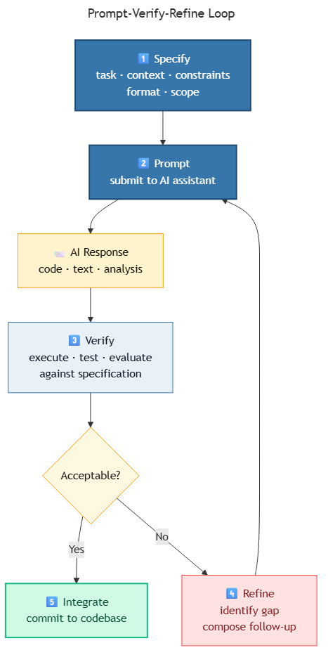

<!-- _class: ai-era -->

# AI Era Extension
## Topic 11 — Generative AI

**Supplementary set of 10 slides** to accompany the original Topic 11 deck

Department of Mechanical & Mechatronics Engineering
Faculty of Engineering
Ubon Ratchathani University

> This topic is, by its nature, AI-centric. The extension deepens the original treatment with practical, current-era working practices.

---

<!-- _class: ai-era -->

# Generative AI — From Novelty to Infrastructure

**Two years ago:**
- Generative AI was a novel topic introduced at the end of a programming course
- Students experimented with chatbots and image generators as curiosities

**Today:**
- Generative AI is **embedded infrastructure** in engineering practice
- Working effectively with AI is a daily skill, not a specialised one
- Engineers who direct AI well outperform those who do not, even when both have equivalent technical knowledge

> Key principle: **The skill is not "using AI" but "directing AI with discipline." The two outcomes are very different.**

---

<!-- _class: ai-era -->

# The Prompt-Verify-Refine Loop



Effective AI collaboration follows a disciplined loop:

| Phase | Activity | Time |
|---|---|---|
| 1. Specify | Define the task with constraints and context | 30–60 seconds |
| 2. Prompt | Submit the specification to the AI assistant | 5 seconds |
| 3. Verify | Read, test, and evaluate the AI's output | 1–5 minutes |
| 4. Refine | Identify gaps and submit a corrective follow-up | 30 seconds |
| 5. Integrate | Accept the output into the codebase only when verified | varies |

> The most common failure mode is skipping phase 3. The most common improvement is investing more in phase 1.

---

<!-- _class: ai-era -->

# Calling an LLM from Python

A minimal integration with the Anthropic Claude API:

```python
import os
from anthropic import Anthropic

client = Anthropic(api_key=os.environ["ANTHROPIC_API_KEY"])

response = client.messages.create(
    model="claude-sonnet-4-5",
    max_tokens=1024,
    messages=[
        {
            "role": "user",
            "content": "Summarise the following lab report in three sentences:\n\n[report text]",
        }
    ],
)

print(response.content[0].text)
```

> The pattern is similar across providers (OpenAI, Google, Anthropic). The principal differences are model names and authentication.

---

<!-- _class: ai-era -->

# What AI Does Well — and What It Does Not

| AI is reliably proficient at | AI is unreliable at |
|---|---|
| Producing standard-pattern code | Knowing current API versions and library updates |
| Explaining unfamiliar code | Maintaining context across long conversations |
| Generating tests for a given function | Inferring unstated business rules |
| Translating between languages and styles | Calculating exact numerical results |
| Summarising and reformatting text | Reasoning about physical systems with subtle behaviour |
| Suggesting refactorings | Distinguishing what it knows from what it has guessed |

> Use AI for tasks in the left column. For tasks in the right column, treat AI output as a draft requiring verification.

---

<!-- _class: ai-era -->

# Common Failure Modes

| Failure | Description | Mitigation |
|---|---|---|
| Hallucination | AI invents APIs, functions, or facts that do not exist | Run the code; verify any cited reference |
| Confident incorrectness | AI states wrong information without uncertainty | Treat declarative statements as hypotheses, not facts |
| Context loss | AI forgets earlier constraints in a long conversation | Restate key constraints in each prompt |
| Over-generation | AI adds features not requested | Specify "do not add features beyond the request" |
| Style drift | AI changes coding style mid-project | Provide a style guide or reference file |
| Stale knowledge | AI uses outdated patterns | Consult current documentation for critical APIs |

> A productive collaboration treats each failure mode as a known risk with a known mitigation.

---

<!-- _class: ai-era -->

# Prompt Engineering — Five Practical Principles

1. **Specify the role** — "You are reviewing Python code for a first-year engineering student."
2. **Supply context** — Include relevant code, data samples, error messages, and constraints.
3. **State the format** — "Respond with a numbered list" or "produce only valid JSON."
4. **Demand verification** — "Identify any assumption you made; flag uncertainty explicitly."
5. **Constrain scope** — "Change only the function `calculate_grade`. Do not modify other code."

```
Example combining all five principles:

You are reviewing Python code for a first-year student.

[paste code]

Please:
1. Identify any errors in the boundary conditions.
2. Respond with a numbered list of issues.
3. For each issue, indicate certainty: certain, likely, or possible.
4. Do not suggest stylistic changes beyond the bugs identified.
```

> Each principle individually improves results; combining them yields dramatically more reliable output.

---

<!-- _class: ai-era -->

# Responsibility and Ethics

The introduction of AI to engineering practice raises responsibilities that students must understand:

| Issue | Engineer's responsibility |
|---|---|
| Verification | Code submitted under one's name must be tested, regardless of who wrote it |
| Attribution | When AI contribution is substantial, disclose it where institutional policy requires |
| Privacy | Do not paste student records, identifiers, or confidential data into public AI services |
| Security | Do not include API keys, passwords, or credentials in prompts |
| Bias | Recognise that AI inherits biases from training data; verify in safety-critical applications |
| Dependency | Maintain skills that do not depend on AI availability |

> AI is a tool. The engineer remains responsible for the work that bears their name.

---

<!-- _class: ai-era -->

# Prompt Template — Working Specification for Any Task

A general-purpose specification template:

```
Objective: [one-sentence description of what you want to accomplish]

Context:
- Project: [what the larger project is]
- Constraints: [any limits — language, library, performance, line count]
- Existing code: [paste relevant existing code, or describe interfaces]

Requirements:
- [specific functional requirement 1]
- [specific functional requirement 2]
- [verification expectation, e.g., "include test cases"]

Format:
- [how the response should be structured]

Out of scope:
- [what NOT to include — features, refactorings, additions]
```

> This template supports nearly any AI task. Adapt the sections; do not omit the structure.

---

<!-- _class: ai-era -->

# In-Class Activity — End-to-End AI Workflow (20 minutes)

**Objective:** Practise the complete prompt-verify-refine loop on a realistic task.

| Time | Activity |
|---|---|
| 3 min | Choose a small engineering task (e.g., parse a sensor data file, compute summary statistics) |
| 4 min | Write a complete specification using the template from the previous slide |
| 3 min | Submit the prompt to an AI assistant; obtain the initial response |
| 5 min | Verify the response: execute the code, test with edge cases, evaluate against the spec |
| 5 min | Submit one corrective follow-up prompt addressing the most significant gap |

> The objective is to internalise the loop. Speed and elegance follow with practice.

---

<!-- _class: ai-era -->

# Summary — Generative AI in Engineering Practice

| Aspect | Two Years Ago | Today |
|---|---|---|
| Role of AI | Curiosity, experimental | Daily infrastructure |
| Engineer's primary skill | Writing code unaided | Directing AI with discipline |
| Failure model | Bugs in human-written code | Hallucination, over-generation, context loss |
| Responsibility | Implicit in authorship | Explicit verification and disclosure |

**Key takeaways for students:**
- Follow the prompt-verify-refine loop deliberately
- Apply the five prompting principles to every non-trivial task
- Recognise the six common failure modes and their mitigations
- Accept that responsibility for the work remains entirely with the engineer

> This concludes the AI-era extension to the original 11 topics. The supplementary 15-week tutorial integrates these principles into a complete programme.
